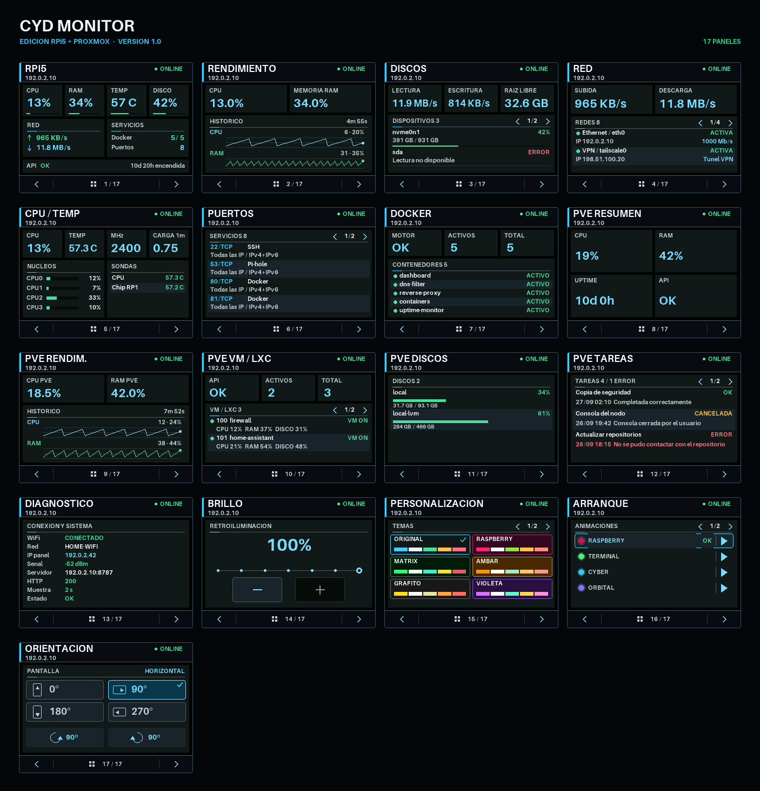

# CYD Monitor: RPi5 + Proxmox

Panel táctil para **ESP32-2432S028R (Cheap Yellow Display)** que monitoriza una
Raspberry Pi 5 y un servidor Proxmox VE desde una sola interfaz.

Esta es la edición combinada del proyecto. El repositorio dispone de estas ramas:

| Rama | Contenido |
|---|---|
| `web` | Instalador web (GitHub Pages) |
| `rpi5-proxmox` | Edición completa: Raspberry Pi 5 y Proxmox VE |
| `rpi5` | Solo Raspberry Pi 5 |
| `proxmox` | Solo Proxmox VE |



*Capturas reales de la pantalla, generadas con datos de ejemplo.*

## Instalación rápida desde el navegador

Sin instalar nada en el PC: abre **<https://mayky23.github.io/rpi5-cyd-monitor/>**
con Chrome, Edge u Opera, elige la edición, escribe tu Wi-Fi, la dirección de la
API y el token, conecta la placa y pulsa *Instalar*. La propia página te da los
comandos exactos para instalar la API en tu servidor.

## Funciones

- Resumen, CPU, RAM, temperatura, discos, red, puertos y Docker de la RPi5.
- Resumen, rendimiento, VM/LXC, almacenamiento y tareas de Proxmox.
- Gráficas históricas independientes con escala adaptativa.
- Estados claros `ONLINE`, `PARCIAL`, `OFFLINE` y `ERROR`.
- Cuatro orientaciones, brillo nocturno, diez temas y navegación táctil.
- Cuatro animaciones de arranque genéricas y una pantalla `PERSONAL`.
- API de solo lectura protegida con token y certificado Proxmox fijado por SHA-256.
- Instalador web (Chrome/Edge/Opera) o instalador de Windows que detecta la placa y carga el firmware.

## Requisitos

- ESP32-2432S028R con cable USB de datos.
- Windows 10/11 con PowerShell y Python 3.10 o posterior.
- Una Raspberry Pi o equipo Debian/Linux para alojar la API.
- Un token de Proxmox VE con el rol de solo lectura `PVEAuditor`.

## 1. Instalar la API

En el equipo Linux:

```bash
git clone --branch rpi5-proxmox --single-branch https://github.com/Mayky23/rpi5-cyd-monitor.git
cd rpi5-cyd-monitor/server
sudo ./install.sh
```

El instalador crea un token aleatorio y conserva `/opt/rpi-monitor/server/.env`
durante futuras actualizaciones. Consúltalo localmente con:

```bash
sudo grep '^MONITOR_API_TOKEN=' /opt/rpi-monitor/server/.env
```

Para activar Proxmox, completa estas variables en ese archivo sin añadir comillas:

```dotenv
PROXMOX_API_URL=https://proxmox.example.lan:8006/api2/json
PROXMOX_TOKEN_ID=monitor@pve!esp32
PROXMOX_TOKEN_SECRET=secreto-del-token-api
PROXMOX_CERT_SHA256=huella-sha256-sin-dos-puntos
```

Usa un token dedicado con el rol `PVEAuditor` sobre `/`. Obtén la huella del
certificado desde el equipo que aloja la API:

```bash
openssl s_client -connect proxmox.example.lan:8006 </dev/null 2>/dev/null \
  | openssl x509 -noout -fingerprint -sha256 \
  | cut -d= -f2 | tr -d ':'
```

Reinicia la API tras editar el archivo:

```bash
sudo systemctl restart rpi-monitor
```

Si Proxmox está apagado o no responde, la API descarta las métricas antiguas y
el panel muestra `OFFLINE` en lugar de datos que ya no son válidos.

## 2. Instalar el firmware

La forma más sencilla es el [instalador web](https://mayky23.github.io/rpi5-cyd-monitor/).
También puedes compilarlo y cargarlo con el instalador de Windows. Conecta la
pantalla al PC y ejecuta:

```powershell
.\Install.ps1
```

El asistente:

1. Localiza Python y prepara PlatformIO si hace falta.
2. Solicita Wi-Fi, URL de la API y token sin publicarlos.
3. Detecta automáticamente placas ESP32 por USB y permite elegir si hay varias.
4. Compila la edición correspondiente a la rama y la carga en la placa.

La configuración privada se guarda en `firmware/include/config.local.h`. Este
archivo está excluido de Git.

## Pantalla de arranque personal

Durante la instalación puedes elegir una imagen PNG/JPG, que se adapta a
320x240 y 240x320, o crear un diseño con título, subtítulo y color. También
puedes generarlo directamente:

```powershell
python firmware/tools/build_custom_splash.py --source "C:\imagenes\logo.png"
python firmware/tools/build_custom_splash.py --title "HOME LAB" --subtitle "SYSTEM STATUS" --accent 00D8A0
```

El recurso resultante se guarda como `firmware/include/custom_splash.local.h`,
también excluido de Git. Selecciona `PERSONAL` desde la página Arranque del panel.

## Seguridad

- No publiques `config.local.h`, `custom_splash.local.h` ni `.env`.
- No reutilices contraseñas personales como tokens de la API.
- No expongas el puerto 8787 directamente a Internet; utiliza una VPN o proxy HTTPS.
- El certificado de Proxmox se valida mediante su huella SHA-256.

## Estructura

| Ruta | Contenido |
|---|---|
| `server/` | API FastAPI de solo lectura, instalador y servicio systemd. |
| `firmware/` | Firmware PlatformIO, fuentes, animaciones y herramientas de generación y captura. |
| `tests/` | Pruebas de la API. |
| `Install.ps1` | Instalador guiado para Windows. |
| `web/` | Instalador web publicado en GitHub Pages. |

## Desarrollo y pruebas

```powershell
python -m pip install -r server/requirements-dev.txt
python -m unittest discover -s tests -v
python firmware/tools/build_gallery.py --check
pio run -d firmware -e esp32-2432S028R
```

El firmware se valida en CI. Las herramientas USB de `firmware/tools` capturan
los paneles, orientaciones, temas y animaciones desde la placa real.

Para regenerar la imagen de este README, instala
`firmware/tools/requirements.txt`, carga el firmware con capturas y ejecuta el
generador. Usa datos de ejemplo, así que no expone tu red ni tus servidores:

```powershell
$env:PLATFORMIO_BUILD_FLAGS = "-D SPLASH_CAPTURE_ENABLED=1"
pio run -d firmware -e esp32-2432S028R -t upload
python firmware/tools/build_gallery.py --capture --port COM3
```

Después ejecuta `Remove-Item Env:PLATFORMIO_BUILD_FLAGS` y vuelve a cargar el
firmware normal con `.\Install.ps1`.

### Instalador web

`web/` contiene la página y `.github/workflows/pages.yml` la publica: compila las
tres ramas, reúne los binarios de cada edición y despliega el sitio. Para
activarlo, en *Settings → Pages* elige *Source: GitHub Actions*. Sube antes
`rpi5` y `proxmox` y por último `main`, o lanza el flujo a mano desde *Actions*.

El firmware lee Wi-Fi, API y token de un bloque de 4 KB que la página escribe en
la partición `spiffs` (`firmware/include/runtime_config.h`). Si no existe, usa los
valores de `config.local.h`, así que `Install.ps1` sigue funcionando igual.
Para probar la página en local:

```powershell
pio run -d firmware -e esp32-2432S028R
python web/build_site.py --local-preview --out $env:TEMP\cyd-preview
python -m http.server 8000 --directory $env:TEMP\cyd-preview
```
