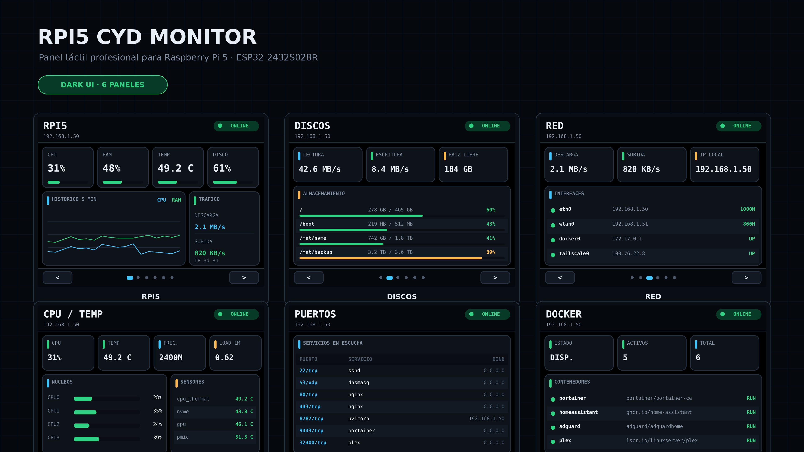

# RPI5 CYD Monitor

Panel táctil profesional para monitorizar una **Raspberry Pi 5** desde una
**ESP32-2432S028R (Cheap Yellow Display)** mediante Wi-Fi.

La Raspberry ejecuta una API FastAPI de solo lectura y la CYD presenta métricas,
gráficas y estados en una interfaz oscura optimizada para **320×240** y
**240×320**.

<p align="center">
  
</p>

## Características

- Tema oscuro real con tarjetas compactas y colores de estado.
- Actualización parcial para evitar el parpadeo.
- Cuatro orientaciones: vertical, horizontal y ambas invertidas.
- Navegación táctil.
- Textos ajustados y truncados para evitar solapamientos.
- CPU total y por núcleo, RAM, temperatura, carga y frecuencia.
- Discos, montajes, lectura, escritura y espacio libre.
- Tráfico de red, interfaces, velocidad e IP local.
- Puertos en escucha y servicio asociado.
- Estado de Docker y contenedores.
- Histórico reciente de CPU y RAM.
- Autenticación mediante token.
- Build y upload en un solo paso con `P1.cmd`.

## Inicio rápido

### 1. Instalar el agente en la Raspberry Pi

```bash
git clone https://github.com/TU_USUARIO/rpi5-cyd-monitor.git
cd rpi5-cyd-monitor/server
sudo ./install.sh
```

### 2. Crear la configuración local del firmware

```powershell
Copy-Item .\firmware\include\config.local.example.h .\firmware\include\config.local.h
notepad .\firmware\include\config.local.h
```

```cpp
#define WIFI_SSID "TU_WIFI"
#define WIFI_PASSWORD "TU_PASSWORD"
#define API_BASE_URL "http://192.168.1.50:8787"
#define API_TOKEN "TU_TOKEN"
```

### 3. Compilar y cargar

```powershell
.\P1.cmd
```

## Pantallas

| Página | Información |
|---|---|
| **RPI5** | CPU, RAM, temperatura, disco, histórico y tráfico |
| **Discos** | Montajes, uso, lectura, escritura y espacio libre |
| **Red** | IP, interfaces, velocidad y tráfico |
| **CPU / Temp** | Carga, frecuencia, núcleos y sensores |
| **Puertos** | Servicios y puertos en escucha |
| **Docker** | Disponibilidad, contenedores y estado |
